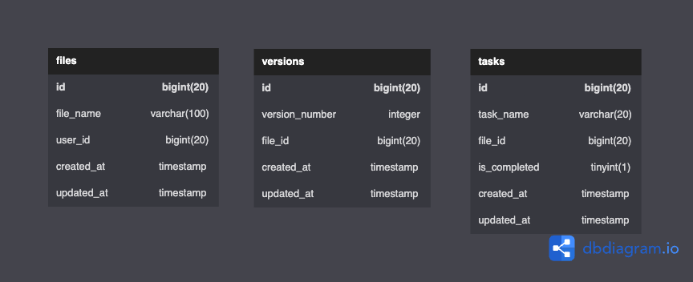

### Tables Structure

The current structure is currently defined as:



```sql
CREATE TABLE `files` (
  `id` bigint(20) PRIMARY KEY AUTO_INCREMENT,
  `file_name` varchar(100) NOT NULL,
  `user_id` bigint(20) NOT NULL,
  `created_at` timestamp,
  `updated_at` timestamp
);

CREATE TABLE `versions` (
  `id` bigint(20) PRIMARY KEY AUTO_INCREMENT,
  `version_number` integer NOT NULL,
  `file_id` bigint(20) NOT NULL,
  `created_at` timestamp,
  `updated_at` timestamp
);

CREATE TABLE `tasks` (
  `id` bigint(20) PRIMARY KEY AUTO_INCREMENT,
  `task_name` varchar(20) NOT NULL,
  `file_id` bigint(20) NOT NULL,
  `is_completed` tinyint(1) NOT NULL,
  `created_at` timestamp,
  `updated_at` timestamp
);

```